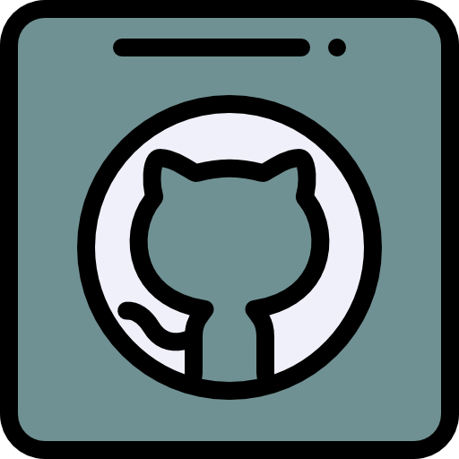

<p align="center">
  <a href="" rel="noopener">
 </a>
</p>

<h1 align="center">nlt-github</h1>

<div align="center">


[](https://gitter.im/kwoc_19/nlt-github?utm_source=share-link&utm_medium=link&utm_campaign=share-link)
[](./LICENSE)
[![KWoC 2018](https://img.shields.io/badge/KWoC-2018-0078D6.svg?style=for-the-badge&longCache=true&logo=data:image/png;base64,iVBORw0KGgoAAAANSUhEUgAAACAAAAAgCAYAAABzenr0AAAGbElEQVRYhdWWa1BTZxrHH7W1yw4qYcMtIk25lOUWkMgCEhMVq0XQKngDrKy3tkMrVNdxRcssVllbW6e1Wm29tSrdWC8UkUKgBEuuJzn3oLYf2moHrcsGoSoGKcl59kNYCnWcJZp2ps/Mf94vZ+b3O+/znPc9AL/DGg0gHicKl4dNiJRH+EbIAgHkj/8mZFG4fII4OmN+ULxiT0i8UhOSoLoQHK9SBycoXx4XPSX6V4cHxWeUhchUX0tkql6JTOWSyFQuSaKqXyJT2YMTVKf9I1PTAGC09+kBcb6BsdOWPynPvBKWnImhSTOGZdLkmRiWnOkIkamOjQ9PivI2ftRTqXOfyS4sNr20abtz9YZynLNsLUb8ZTZOmjwT0+fm4/LiTfjixgpcvGZ9Z6wip2JCWILIqwbpcwtzPjj2afv1Gx3CvzvsWK/V4YzcIoxV5OC7B49j+/Ub+J/Om9h4Qd//TN6KjwF8A7wqkDInP27voSq6w37T1XuvDxu0Oly0+lXMLnwJ9x6uwq7uH/FOTw+e0zT3Tp2zcAcA+HhVQCKfLs5dXao+fb6xz2BhsKzyHdz+zgeo/qweS8vfwHOaFtQRlFD6WqV9UuyUVQAwxqsCEDw5IHnW4uP7jv7r3pX2a1h1tg637T6Ar+3ah2U730Pu0teoI2ghd2XptaCY1GXehYeG+gQlqNZKZNOvTV9YJOz/SI1GK4smisdWgkYzbUPNBSOWbP0nRqVl9QXFTzvhJ02SAsCoh2aeOnVqjF6vD29p0Sdu3rE7L3PRSuPUnAKXYl4hZuW/gKvXl+PWnXvw9d37cWPFLsx/8W84I7cIM3IKUJFTYF/011f+cfLk2ZSWFkNcdXX1nzwW0FJUBMNwapbj28wW8rs6TfNPtfVNOJiGJqzTNOPnjVo83/AF1tY3Yc3nGqyurcczNXVCvUZrN5ktl02EhaqtrXsVAJ7wSECn08UyLMdyvE3gbW34oHC8DRmWQ4pm0EpSaLEOj9FE9J34RL1fLBaP80igtbX1KYblDLytzfUgMMvxA2D6PvAQgd6Pj1e9CZ5+lmp1zSQzQbVwvM31ILCZsKLRSKDRZEHCQg4DW0l64BlLz4eHjpQDgGe35bwVxQr1mdrLLMcLQ8E0w6KVpNFgIlCvN6JBb0Kdzogms1vCStJIUgxSNIskSeOFVr1jy7aduzzdgccSZ8zf8Pbew7cYlkeW45FhOSQpBi1WCgkLiXqDCQ16I5oMbgEzYUWSot1gyj0PViuFmqYW15JV67RjJU//eeR4/8jxkWlZB7dW7u4nKQZJ6v4em8wWt4TBhCbCghTNDBtEkqKRYTmsb9RiZm5Ru59UvgBGfE1L5GJpyuyTr2ze7jSYiPvghIUc7DlJMUjSP0taSRpphkWW45HlbVh9vgHTspbeEoUnFcNI50AULp8QJp95aFVJWf+XOuN9AlaS+rnPQ3aHohlkOR453jY4sOoz5zA5M/eOnzSpFADGjrQJj4XKVCVL167vamjSCmbCOvjWQ/v8v91wTzyL7nmxDYQXaIYVDhytEuIysn4YL4nKB08uKFGELD576Zqqt9872K0+c06gaE7gbG1oa7uEvO0icnzbYGxtl7Dt4uXB8LaLwvmGZuHwcbWz5O/bOqWyjFoQBSWMGD5QoyPl05LlsxY2rizd4vzmyveCw+FAh6MX3evQ9A6LvbNLqHjrfWFKZt7tKLnywB/EoSrw9CgGAAD/yPHBccr3lQuK+mjbJRciCjiCunajQygs3iRIEpQ3fCVPLwNPD6EhNSYgVlESo5h366OTn7l+6u8fiYDwpYkU0rMLXIExqaxP4JPp8CjXsig6LWNi4nR2xbrNzm+vtgv/bxc6u7qF8l17BWly5j1/aeIRAAh+aDgAAPhJ/QJipm6PUeR0v7X/qGC/2fVAgZ67DuHTmgZXenaBKyA65SvfwPA88MKv2aixIVExgTGpx1LmLLl15JOzrqvt110d9puufqdTcDqdwt27DuFq+w+uZr3FuWBlSX9IvOJ734nR5QAQ+KjwwXo8ICopLFF5YOmaDd+WVe75ceeewz1andmhJ6g7J07X3C5/c9/tdVsqu1Nm5bGisNgyAJjoNfhAjfbxnxgaOVk5P3na3PWzFhRULH7+hR1Zuctfn/1c/o6ZOUsqUpRZG6NlKc8CgNjb8GEi4D5SfQDgj79Yn4CHmPj/Ah8OBXTGJ+jbAAAAAElFTkSuQmCC)](https://kwoc.kossiitkgp.org/)
[](https://github.com/dibyasonu/nlt-github/pulls)


<h4>nlt-github is an open source project which makes sure that you don't have to leave your beloved terminal to upload a new project in Github</h4>
</div>

------------------------------------------
### Demo
<p align="center">
    
</p>

## Installation
`$ git clone https://github.com/dibyasonu/nlt-github.git`

`$ pip install --editable .`

## Steps
1. **First we need to create a user. Creating a user creates a personal access token and stores the data to access the token
locally**

    `$ nlt config --adduser`

2. **We add files like gitignore, LICENSE and README. (Optional)**

    `$ nlt add --gitignore` shows templates list for different languages, the user can select any no of languages and accordingly
gitignore is addded to your project folder.

    `$ nlt add --license` shows templates list for different LICENSE, the user can select any one and 
LICENSE file is generated and accordingly addded to your project folder.

    `$ nlt add --readme` adds a README.md to your project.

3. **We create a Repo in your github account. We upload the project from the terminal.**

    `$ nlt create-remote `
Prompts for the **username** and the details like **repo name** and **Description** of the repo. It creates a repo 
according to given details, and adds its remote address to the origin referrence to the local project.

    `$ nlt create-remote --privy`
 It does the above task but the repo created is a **private** repo. 

    Now you can push the project simply by  `git push --all`


## Usage

`$ nlt --help`
```
Usage: nlt [OPTIONS] COMMAND [ARGS]...

Options:
  --help  Show this message and exit.

Commands:
  add            Add required files
  config         Configure Users
  create-remote  create a new repo in Github and add remote origin to the
                 local project.
  list-repos     view list of repositories belonging to the user.
  pr             list pull requests of current repository
  view-profile   view basic info of any particular user.
```

#### Add required files

`$ nlt add --help`

```
Usage: nlt add [OPTIONS]

  Add required files

Options:
  --license    Add license templates from the list to your project.
  --gitignore  Add gitignore template from the list to your Project.
  --readme     Addd README to your project.
```

#### Configure Users

`$ nlt config --help`

```
Usage: nlt config [OPTIONS]

  Configure Users

Options:
  --adduser    Creates a personal access token in github and stores them locally.
  --deluser    Remove created personal access token from github and locally.
  --showusers  Show added users.
```

#### Create repo

`$ nlt create-remote --help`

```
Usage: nlt create-remote [OPTIONS]

Options:
  --username TEXT  provide username in whose account the new repo is to be created.
  --privy          create a private repository if used.
```
#### List repo

`$ nlt list-repos --help`

```
Usage: nlt list-repos [OPTIONS]

  view list of repositories belonging to the user, private repositories can
  also be listed if user is configured.

Options:
  --username TEXT  provide username in whose repos are to be listed.
  --all            specify if private repos are needed,in that case username
                   must be configured.
  --help           Show this message and exit.
```
#### Handle Pull Request

`$ nlt pr --help`

```
Usage: nlt pr [OPTIONS]

  list open pull requests at remote of current git repository test them,
  merge them or comment on the thread

Options:
  --help  Show this message and exit.
```
#### View Profile

`$ nlt view-profile --help`

```
Usage: nlt view-profile [OPTIONS]

  view basic profile information of a particular user

Options:
  --username TEXT  provide username in whose info is needed.
  --all            specify if private repos count is needed,in that case
                   username must be configured.
  --help           Show this message and exit.
```
------------------------------------------
### Contributing

 * We're are open to `enhancements` & `bug-fixes` :smile:.
 * Feel free to add issues and submit patches

------------------------------------------
### Author
Dibya Ranjan Jena - [dibyasonu](https://github.com/dibyasonu)

See also the list of [contributors](https://github.com/dibyasonu/nlt-github/graphs/contributors) who participated in this project.

------------------------------------------
### License
This project is licensed under the MIT - see the [LICENSE](./LICENSE) file for details


